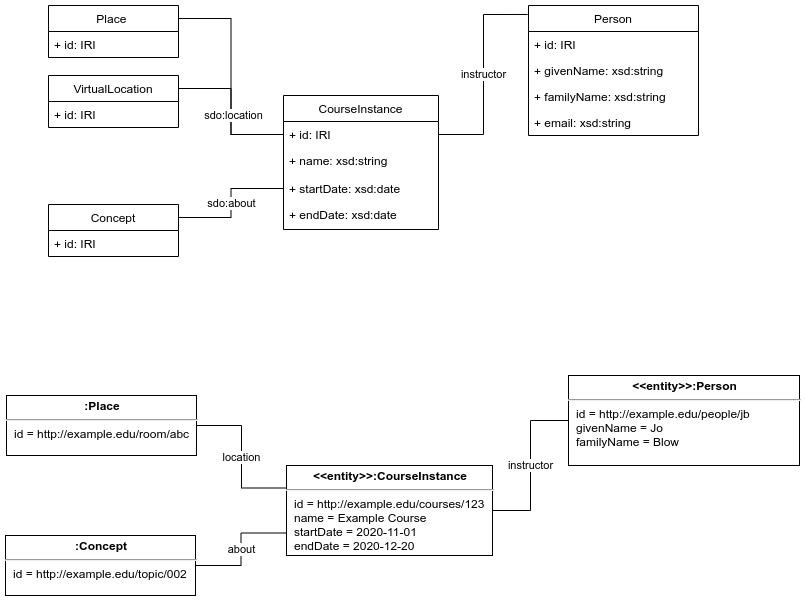

# Application Profile for course information using schema.org

[courseSchemaOrgAP.csv]courseSchemaOrgAP.csv is a very simplified application profile based on [schema.org](https://schema.org/CourseInstance) to for information about courses. 

## UML Data model & example instance data

## Comments

The namespace `sdo:` stands for `https://schema.org/`; this is omitted from the 

The location of the course can be either a Place or a VirtualLocation. The TAP csv a comma is used to separate these options though this currently under discussion.

Some desired constraints that are currently not supported are listed as notes, these are: the start date must be in the future; the end date must be after the start date; and, the text provided for the email must match a suitable regex.